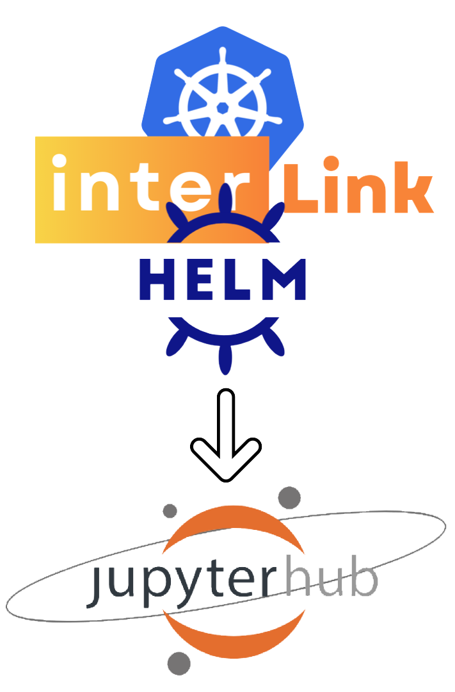

# Helm chart to deploy JupyterHub on Kubernetes with InterLink

<p align="center">
  
</p>

This chart is in **alpha** state. It is not yet feature complete and it is considered experimental. 
A lot of features are missing and we are working to improve it, but it is already possible to deploy a JupyterHub on Kubernetes using this Helm chart.

# How to use it

Read carefully the following instructions to deploy a JupyterHub on Kubernetes using this Helm chart. This Helm chart has been designed to operate using the InterLink package (InterLink). This guide is divided in three sections:

- **Virtual Kubelet (VK) node deployment**: in this section the VK deployment is explained i.e. all the steps necessary to deploy the VK in your Kubernetes cluster.

- **Target node setup**: in this section the target node setup is explained i.e. all the steps necessary to configure the target node (i.e. the node with the GPU, or without where you want to offload)

- **JHUB helm chart deployment**: the second and last section explains how to deploy the JupyterHub on Kubernetes using this helm chart. 

# Pre-requisites

You should have a Kubernetes cluster (with at least 1 node) running and `kubectl` configured to use it. You can use Minikube to run a local Kubernetes cluster or use whatever service you prefer. The important thing is that the Kubernetes cluster should be reachable and has the SSL certificates properly configured. 
You can use cert-manager to manage the SSL certificates (see the [cert-manager documentation](https://cert-manager.io/)). Also, be sure to have the correct ingress controller configured and installed in your Kubernetes cluster.
You may have those pods running in your Kubernetes cluster similar to the following:

```bash
NAMESPACE             NAME                                                 READY   STATUS    RESTARTS   AGE
cert-manager          cert-manager-7bfbbd5f46-ktg6w                        1/1     Running   0          27h
cert-manager          cert-manager-cainjector-84cfdc869c-xvfnd             1/1     Running   0          27h
cert-manager          cert-manager-webhook-649b4d699f-ckl29                1/1     Running   0          27h
ingress-nginx         ingress-nginx-controller-76df688779-228f9            1/1     Running   0          27h
```

# The InterLink Flow

<p align="center">
  
</p>

Take a few seconds to understand the InterLink flow involded in the deployment of the JupyterHub on Kubernetes. During this guide, you are going to create a k8s cluster with a single node, and this node is the control-plane node. On this node, you will deploy the Virtual Kubelet node using the InterLink APIs. The Virtual Kubelet node is deployed as a POD and it's reponsible for managing the resources
outside the cluster. The requests that are sent to the Virtual Kubelet are propagated to the InterLink API server that is running on the target node. The InterLink API server is running 
behind an OAuth2.0 proxy that is responsible for the authentication of the requests. The InterLink API server is able to communicate with the Docker sidecar API server, that will effectively
run the jobs on the target node. In this specific use case, the job is a Jupyter notebook. 

# 1. Virtual Kubelet (VK) node deployment

The Virtual Kubelet (VK) is a Kubernetes kubelet implementation that masquerades as a kubelet for the purposes of connecting Kubernetes to other APIs. The VK is a node in the Kubernetes cluster that can be used to offload the JupyterHub pods. In this section we will explain how to deploy the VK in your Kubernetes cluster using the InterLink package. First of all, be sure to be able to interact with your Kubernetes cluster using `kubectl` and export the KUBECONFIG environment variable.
  
  ```bash
  export KUBECONFIG=/path/to/your/kubeconfig
  ```

Then, clone this repository and navigate to the main directory in order to deploy the VK in your Kubernetes cluster.

  ```bash
  git clone https://github.com/Bianco95/interLink.git && git checkout dockersidecar-gpu && cd interlink/examples/interlink-docker
  ```
Edit the **vk/InterLinkConfig.yaml** file and change only one value: the **InterlinkURL**: change it with the public IP address of the target node. Leave the other values as they are (be sure to have the InterlinkPort set to 443).

You are one step closer to deploy the virtual kubelet node. Inside the vk folder there is the **deployment.yaml** file. You have to change some environment variables. Change the following values:

- name: IAM_SERVER
  value: "https://iam.cloud.infn.it/"
- name: IAM_CLIENT_ID
  value: "<client-id>"
- name: IAM_CLIENT_SECRET
  value: "<client-secret>"
- name: IAM_VK_AUD
  value: "<groups>" (e.g. 'users')

The IAM_SERVER is the URL of the IAM server and you have to use the correct one for your organization. The IAM_CLIENT_ID and IAM_CLIENT_SECRET are the client id and client secret of the IAM server. The IAM_VK_AUD is the target audience (leave it blank if you don't know what it is).
Now it's time to configure the resources of the virtual kubelet node. Inside the vk folder there is a file called **vk-cfg.json**. Here you can set the resources of the virtual kubelet node. A good configuration can be the following:
 
```
{
    "test-vk": {
        "cpu": "24", 
        "memory": "32Gi",
        "pods": "100",
        "nvidia.com/gpu": 1
    }
}
```
In this way, you are setting the virtual kubelet node with 24 CPUs, 32Gi of memory, 100 pods and 1 GPU. Clearly, you have to change the values based on your needs and the resources of the target node.

If you have only one node in your cluster, maybe it is necessary to remove the 'NoSchedule' taint from the node. You can do this with the following command:
  
```bash
kubectl taint nodes <node-name> node-role.kubernetes.io/master:NoSchedule-
```

Now, create a namespace for the virtual kubelet node with the following command:

```bash
kubectl create namespace vk
```

And deploy the virtual kubelet node with the following command:

```bash
kubectl apply -k vk/ --namespace vk
```

Wait until the virtual kubelet is deployed. You can check the status of the deployment with the following command:
  
```bash
kubectl get pods --namespace vk
```

You should see something like this:
```bash
NAME                      READY   STATUS    RESTARTS   AGE
test-vk-f899f8844-hm7qv   3/3     Running   0          3h47m
```

Where test-vk-f899f8844-hm7qv is the name of the virtual kubelet pod. It can be different. Check if the node has been added to the k8s cluster with the following command:

```bash
kubectl get nodes
```
You should see something like this:
```bash
NAME                  STATUS   ROLES           AGE     VERSION
test-vk               Ready    agent           3h47m   
```

If the virtual kubelet is running, everything is ok. If not, don't even think to go on with the installation of the helm JupyterHub. If you don't see node in ready state or you don't see the virtual kubelet node at all, contact the support. Using the describe command, you should see something like this in your virtual kubelet node:
  
  ```bash
  kubectl describe node test-vk
  ```
  
  ```bash
  Capacity:
  cpu:             10
  memory:          800Gi
  nvidia.com/gpu:  1
  pods:            1k
Allocatable:
  cpu:             10
  memory:          800Gi
  nvidia.com/gpu:  1
  pods:            1k
  ```

Label the virtual kubelet node with the following command:

```bash
kubectl label node test-vk accelerator=T4
```
If your node has a Tesla T4 GPU, for example. If your node does not have a GPU, you can label the node in the following way:
  
  ```bash
  kubectl label node test-vk accelerator=none
  ```

# 2. Target node setup

Your target node, where the actual offloading will happen, should have different components installed based on the sidecar plugin you want to use.
Whatever sidecar plugin you want to use, you have to install the InterLink API server on the target node. The InterLink API server is responsible for handling the requests coming from the Virtual Kubelet node. The InterLink API server is running behind an OAuth2.0 proxy that is responsible for the authentication of the requests. The InterLink API server is able to communicate with the sidecar API server, that will effectively run the jobs on the target node.

So, let's start with the setup of the OAuth2.0 proxy.
Download and unpack the linux binary of the OAuth2.0 proxy from the following commands:
```bash
wget https://github.com/oauth2-proxy/oauth2-proxy/releases/download/v7.5.1/oauth2-proxy-v7.5.1.linux-amd64.tar.gz && tar -xvf oauth2-proxy-v7.5.1.linux-amd64.tar.gz
```
Navigate inside the directory. Create a folder called **certificates** (or whatever you want) and move inside the directory. Inside the certificates directory, create the file **cert.pem** and the **certificate.crt** with the following content:

Come back to the main directory and create a bash script to start the OAuth2.0 proxy. Create a bash script, called for example start-oauth2-proxy.sh, with the following content:
```bash
~/oauth2-proxy-v7.5.1.linux-amd64/oauth2-proxy \
	--client-id client_id \
	--client-secret client_secret \
	--http-address 0.0.0.0:80 \
	--oidc-extra-audience users \
	--oidc-issuer-url https://iam.cloud.infn.it/ \
	--pass-authorization-header true \
	--provider oidc \
	--redirect-url http://localhost:8081 \
	--upstream http://127.0.0.1:3000 \
	--validate-url https://iam.cloud.infn.it/token \
	--email-domain=* \
	--skip-auth-route="*='*'" \
    --https-address 0.0.0.0:443 \
	--tls-cert-file /home/ubuntu/oauth2-proxy/certificates/certificate.crt \
	--tls-key-file /home/ubuntu/oauth2-proxy/certificates/private.key \
	--oidc-groups-claim users \
    --cookie-secret cookie_scret \
    --tls-cipher-suite=TLS_ECDHE_RSA_WITH_AES_128_CBC_SHA \
    --tls-cipher-suite=TLS_ECDHE_RSA_WITH_AES_128_CBC_SHA \
    --tls-cipher-suite=TLS_ECDHE_RSA_WITH_AES_128_GCM_SHA256 \
    --tls-cipher-suite=TLS_ECDHE_RSA_WITH_AES_256_CBC_SHA \
    --tls-cipher-suite=TLS_ECDHE_RSA_WITH_AES_256_GCM_SHA384 \
    --tls-cipher-suite=TLS_ECDHE_RSA_WITH_CHACHA20_POLY1305_SHA256  \
    --tls-cipher-suite=TLS_RSA_WITH_AES_128_CBC_SHA \
    --tls-cipher-suite=TLS_RSA_WITH_AES_128_GCM_SHA256 \
    --tls-cipher-suite=TLS_RSA_WITH_AES_256_CBC_SHA \
    --tls-cipher-suite=TLS_RSA_WITH_AES_256_GCM_SHA384 \
    --tls-cipher-suite= TLS_AKE_WITH_AES_128_GCM_SHA256 \
	--skip-jwt-bearer-tokens true
```

Change the tls-cert-file, tls-key-file, client-id, client-secret, oidc-issuer-url, oidc-extra-audience with the correct values. 
You can start now the OAuth2.0 proxy with the following command:
```bash
sudo nohup ./start.sh > oauth2.log 2>&1 &
```
This command will run the OAuth2.0 proxy in the background and will redirect the output to the file oauth2.log.

Now, it's time to start the InterLink API server. Clone the Interlink repository with the folliwing command:
```bash
git clone https://github.com/Bianco95/interLink.git
```
Inside the home directory (or wherever you want), create the file **InterLinkConfig.yaml** with the following content:

```
VKTokenFile: "$HOME/interLink/token"
InterlinkURL: "http://127.0.0.1"
SidecarURL: "http://127.0.0.1"
InterlinkPort: "3000"
SidecarPort: "4000"
SbatchPath: "/usr/bin/sbatch"
ScancelPath: "/usr/bin/scancel"
SqueuePath: "/usr/bin/squeue"
CommandPrefix: ""
ExportPodData: true
DataRootFolder: ".local/interlink/jobs/"
ServiceAccount: "interlink"
Namespace: "vk"
Tsocks: false
TsocksPath: "$WORK/tsocks-1.8beta5+ds1/libtsocks.so"
TsocksLoginNode: "login01"
BashPath: /bin/bash
VerboseLogging: true
ErrorsOnlyLogging: false
```

The parameters really necessary are the **InterlinkURL** and the **SidecarURL** as well as the **InterlinkPort** and the **SidecarPort**. The other parameters are optional. As we said before, the OAuth2.0 proxy will authenticate the requests from the Virtual Kubelet and redirect them to the InterLink API server. For this reason, the InterLink API server and the Sidecar API server will run on http://127.0.0.1 and it is not necessary to expose any ports to the external world. The OAuth2.0 proxy will take care of this.

Now, it's time to start the InterLink API server. Go inside the  **interLink/bin** folder and export the INTERLINKCONFIGPATH environment variable with the following command:
```bash
export INTERLINKCONFIGPATH=$HOME/InterLinkConfig.yaml
```
**Change the path with the correct path where the InterLinkConfig.yaml file is located**.

Finally, start the InterLink API server with the following command:
```bash
nohup ./interlink > interlink.log 2>&1 &
```
And check if the server is running with the following command:
```bash
ps aux | grep interlink
``` 
Check also if those services are listening on the correct ports with the following command:
```bash
lsof -i -P -n | grep LISTEN
```

Now, choose the sidecar plugin you want to use and follow the instructions in the next sections.

## Docker sidecar plugin

The Docker sidecar plugin exploits the Docker API to handle the requests coming from the Virtual Kubelet as docker containers.
So, you need to install Docker on the target node. You can follow the official Docker installation guide to install Docker on your target node (https://docs.docker.com/engine/install/).
If your target node has a GPU, you should install the NVIDIA Container Toolkit to enable the GPU support in the Docker containers. You can follow the official NVIDIA Container Toolkit installation guide to install it on your target node (https://docs.nvidia.com/datacenter/cloud-native/container-toolkit/install-guide.html).

Inside the **interLink/bin** folder, there is the **docker-sd** binary. You have to start the Docker sidecar plugin with the following command:
```bash
nohup ./docker-sd > dockersd.log 2>&1 &
```
Check if the Docker sidecar plugin is running with the following command:
```bash
ps aux | grep docker-sd
```
and again, check if the service is listening on the correct port with the following command:
```bash
lsof -i -P -n | grep LISTEN
```

# 3. JHUB helm chart deployment

Before deploying the chart, some prerequisites are needed. First of all, create a local directory necessary to the JupyterHub to store the data. Now you have to ssh into your node and execute the following command:

```bash
mkdir -p /mnt/data/helm-jhub-volume
```

Where **/mnt/data/helm-jhub-volume** is the directory where the data will be stored. Use sudo if necessary. Moreover, the directory must be accessible from the Kubernetes cluster so change the permissions if necessary with the following command:

```bash
chmod -R 777 /mnt/data/helm-jhub-volume
```

Again, use sudo if necessary. Exit from the node and go back to your local machine. Use this path directory because it is the default path directory used in the helm chart. If you want to use a different path, you have to change the values.yaml but it is not recommended.

The you need to create a namespace where the chart will be deployed. You can also create the namespace simultaneously with the deployment of the helm chart, but we create it in advance to have more control over the deployment. You can do this with the following command:

```bash
kubectl create namespace helm-jhub-namespace
```

Where **helm-jhub-namespace** is the name of the namespace where the chart will be deployed. If a namespace already exists, you can skip this step or, if you want to start from a clean state, you can delete the namespace with the following command:

```bash
kubectl delete namespace helm-jhub-namespace
```

After that, you have to change the values inside the file change-values.yaml.

As you can see, there are some values that you have to change. The most important are the following:

- **HOSTNAME**: the hostname where JHUB will be reachable.
- **IAM_SERVER**: the IAM server URL of the authentication server.
- **CLIENT_ID**: the client ID of the application registered on the IAM server (yes, you have to register an application on the IAM server).
- **CLIENT_SECRET**: the client secret of the application registered on the IAM server.
- **CALLBACK_URL**: the callback URL of the application registered on the IAM server.
- **JHUB_HOST**: the host of the JupyterHub. It is the URL where the JupyterHub will be deployed (use the same value of the HOSTNAME).
- **JHUB_PORT**: the port of the JupyterHub. It is the port where the JupyterHub will be deployed (use 443).
- **JHUB_API_URL**: the API URL of the JupyterHub. It is the URL of the JupyterHub API.
- **JHUB_URL**: the base URL of the JupyterHub. It is the URL of the JupyterHub.
- **NAMESPACE**: the namespace where the JupyterHub will be deployed.
Probably, you only have to change the hostname. After that, if necessary, change the permissions of the file. Before do it, go inside the directory where the file is located and then execute the following command:
```bash
chmod a+x change-values.yaml
```
And then execute the file with the following command:
```bash
./change-values.yaml
```
As you can see, the jupyter_template.py file is used as a template and from it a new file called jupyterhubcustomconfig.py is created and moved inside the jhub folder.

Before deploying the chart, you have to manually download two images (for some reason if you don't do this, the helm install command stuck).
```bash
sudo ctr images pull ghcr.io/comp-dev-cms-ita/ssh-forwarder:v0.0.3
sudo ctr images pull ghcr.io/comp-dev-cms-ita/ssh-listener:v0.0.3
```

Deploy the chart with the following command:
```
helm upgrade --install helm-jhub-release interlink-jhub/ -n helm-jhub-namespace --debug
```
